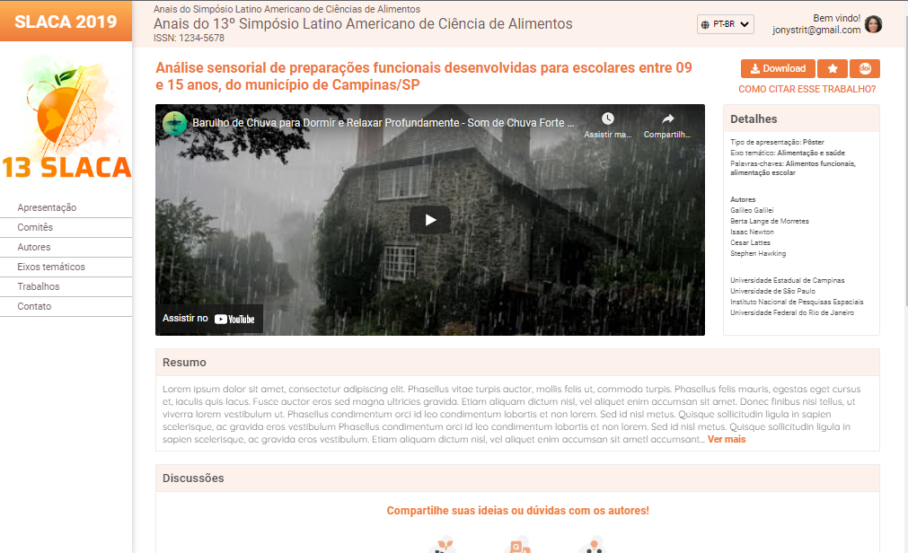

<h1 align="center"> ⛈️Desafio Chuva </h1>

<h3> 💻 Sobre o projeto</h3>

Esse é uma página feita para um desafio de HTML e CSS do processo seletivo sa Chuva.

📝 O sistema possui:

 <li>Criação de tópico de perguntas</li>
 <li>Área de resposta</li>
 <li>Área com vídeo</li>
  
 
 <h2>🖼 Imagens da tela da aplicação funcionando: </h2>

  
  

<h2>🚀 Tecnologias utilizadas: </h2>

  
  
  

 
<h2>👷 Como testar? </h2>
<h3>Entre com o seguinte link: </h3>
<a target="_blank" href="https://desafio-chuva.vercel.app/">https://desafio-chuva.vercel.app/</a>
<h3>Ou</h3>
<li> Clone o repositório com: git clone https://github.com/johnatanSO/desafio-chuva.git
<li> Entre em uma IDE de sua preferência

 
 

 <h2>🎓 Autores</h2>
 <h3>Feito com o 💜 by <a target="_blank" href="https://github.com/johnatanSO" target="_blank">Johnatan Santos</a></h3>

